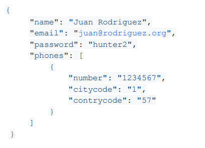
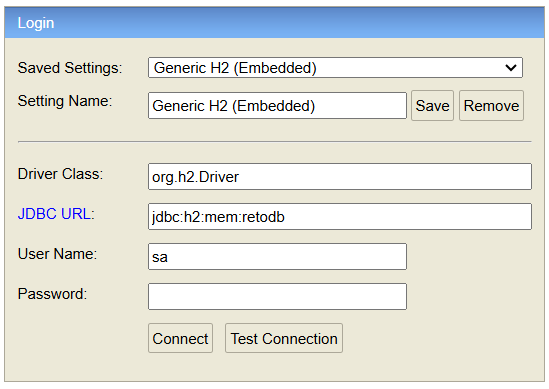

# Documentación de API Rest Creacion de Usuario v1.0.0
## Descripción del proyecto

Este proyecto implementa un API para creacion de Usuario. Ese endpoint deberá recibir un usuario con los campos "nombre", "correo", "contraseña",
más un listado de objetos "teléfono", por lo tanto los datos de entrada son de la siguiente manera.



## Recursos
El proyecto esta creado con las siguientes tecnologías, las primeras 4 se obtienen
al momento de crear el proyecto.

| Plugin                | URL                      |
|-----------------------|--------------------------|
| Spring Web            | https://start.spring.io/ |
| Spring Data JPA       | https://start.spring.io/ |
| Lombok                | https://start.spring.io/ |
| H2 Database           | https://start.spring.io/ |
| Spring Doc (opcional) | https://springdoc.org/#getting-started |

## Accesos

Acceso a la base de datos H2 mediante URL:

```sh
url: http://localhost:8080/reto/h2-console/
user: sa
password: 
```


Acceso a la UI de la documentación de la API mediante URL:
```sh
url: http://localhost:8080/hotel-softtek/swagger-ui/index.html#/
```


## Uso en Postman

### GET
```sh
http://localhost:8080/reto/api/v1/user
```

### POST (crear Huesped)
```sh
http://localhost:8080/reto/api/v1/user
```
Hay que insertar un JSON para esta petición.

``` json
{
	"name": "Juan Rodriguez",
	"email": "juan@rodriguez.org",
	"password": "hunter2",
	"phones": [
		{
		"number": "1234567",
		"citycode": "1",
		"contrycode": "57"
		}
	]
}
```
Añadir SpringDoc: https://springdoc.org/#getting-started

Creador: Frank Abad (repositorio: https://github.com/FrankAbad21/retospring)
